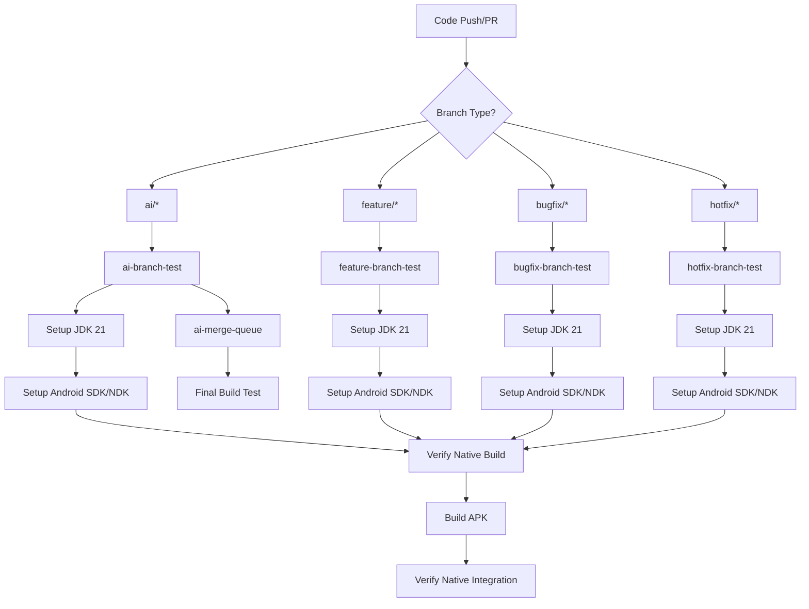

# Native Build Integration in GitHub Workflows

## Overview

This document describes the integration of Android native code (NDK) builds into the project's GitHub workflows. The changes ensure that native libraries from the `core-security` module are properly built and integrated into the Android application during CI/CD processes.

## Changes Made

### 1. Workflow File Modifications

#### `worktree-ci.yml` - Enhanced with Native Build Support

Added to **all branch workflows** (ai, feature, bugfix, hotfix, and merge queue):

1. **Android SDK/NDK Setup**:
   ```yaml
   - name: Setup Android SDK
     uses: android-actions/setup-android@v3
     with:
       api-level: 34
       build-tools: 34.0.0
       ndk-version: '26.1.10909125'
   ```

2. **Native Library Build Verification**:
   ```yaml
   - name: Verify Native Library Build
     run: |
       echo "Building native libraries for core-security module..."
       ./gradlew :core-security:assembleDebug --info
       
       # Check if native libraries were built
       if [ -d "core-security/build/intermediates/cxx" ]; then
         echo "✅ Native libraries build directory found"
         find core-security/build/intermediates/cxx -name "*.so" -type f | head -5 || echo "No .so files found yet"
       else
         echo "❌ Native libraries build directory not found"
       fi
   ```

3. **Native Integration Verification**:
   ```yaml
   - name: Verify Native Integration
     run: |
       echo "Checking native library integration in APK..."
       # Extract and examine the APK for native libraries
       if [ -f "app/build/outputs/apk/debug/app-debug.apk" ]; then
         unzip -l app/build/outputs/apk/debug/app-debug.apk | grep -E "\.so$" || echo "No native libraries found in APK"
       else
         echo "Debug APK not found"
       fi
   ```

#### `security-and-maintenance.yml` - Reverted Changes

- Removed Android SDK/NDK setup that was previously added
- Kept the workflow focused on its original scheduled security scanning purpose
- Avoided potential conflicts with the more comprehensive worktree workflows

#### `ci.yml` - Minimal Build Check Maintained

- Kept the lightweight Kotlin compilation check for `core-security`
- Continues on build errors to avoid breaking the fast CI pipeline
- Provides early feedback on Kotlin code issues

### 2. Workflow Architecture



### 3. Build Process Flow

1. **Setup Phase**: JDK 21, Android SDK (API 34), NDK (26.1.10909125)
2. **Quality Checks**: Detekt, KtLint, Lint
3. **Unit Tests**: All modules including integration tests
4. **Native Build Verification**: Explicit `core-security` module build
5. **APK Build**: Debug and Release variants
6. **Integration Verification**: Check native libraries in final APK
7. **Artifact Upload**: APKs, reports, and build outputs

### 4. Native Library Verification

The workflows now perform comprehensive verification of native code integration:

- **Build Directory Check**: Verifies `core-security/build/intermediates/cxx` exists
- **Shared Library Detection**: Searches for `.so` files in build output
- **APK Integration Check**: Examines final APK contents for native libraries
- **Build Logging**: Uses `--info` flag for detailed build information

## Benefits

### 1. **Comprehensive Testing**
- Native code is built and tested on every branch push and PR
- Integration issues are caught early in the development process
- Consistent build environment across all branch workflows

### 2. **Early Detection**
- Native library build failures are detected before APK assembly
- Missing NDK setup or configuration issues are caught immediately
- Integration problems are identified before merge to main

### 3. **Standardized Environment**
- Consistent Android SDK (API 34) and NDK (26.1.10909125) versions
- Uniform build process across all development branches
- Predictable native library compilation environment

### 4. **Build Verification**
- Explicit verification that native libraries are included in final APK
- Clear logging and error reporting for troubleshooting
- Automated checks prevent incomplete native integration

## Configuration Details

### NDK Version
- **Version**: 26.1.10909125
- **Compatibility**: Android API 34
- **C++ Standard**: C++17 (configured in `core-security` module)

### Build Tools
- **Android Gradle Plugin**: 8.6.1
- **Gradle**: 8.9
- **CMake**: Latest stable version provided by NDK

### Target Architectures
- **arm64-v8a**: Primary 64-bit ARM architecture
- **armeabi-v7a**: Legacy 32-bit ARM support
- **x86_64**: Emulator support
- **x86**: Legacy emulator support

## Troubleshooting

### Common Issues

1. **Native Build Directory Not Found**
   - Check NDK installation and version
   - Verify CMakeLists.txt configuration
   - Ensure proper module dependencies

2. **No .so Files Generated**
   - Check C++ source code compilation
   - Verify CMake configuration
   - Review build logs for compilation errors

3. **APK Missing Native Libraries**
   - Check `android` block in `core-security/build.gradle.kts`
   - Verify packaging options for native libraries
   - Review app module dependency configuration

### Debug Commands

For local troubleshooting:

```bash
# Check native build output
./gradlew :core-security:assembleDebug --info

# Verify build directory structure
find core-security/build/intermediates/cxx -type f -name "*.so"

# Check APK contents
unzip -l app/build/outputs/apk/debug/app-debug.apk | grep "\.so$"
```

## Future Enhancements

### Potential Improvements

1. **Native Library Testing**
   - Add unit tests for native code functionality
   - Implement integration tests for JNI interface
   - Add performance benchmarks for native operations

2. **Advanced Verification**
   - Symbol table verification for native libraries
   - Architecture-specific library validation
   - Runtime loading tests

3. **Build Optimization**
   - Parallel native library builds
   - Caching of native build artifacts
   - Conditional native builds based on changes

### Monitoring and Metrics

- Track native build times across workflows
- Monitor APK size impact of native libraries
- Collect metrics on native build failure rates

## References

- [Android NDK Documentation](https://developer.android.com/ndk)
- [CMake Build Configuration](https://developer.android.com/ndk/guides/cmake)
- [GitHub Actions Android Setup](https://github.com/marketplace/actions/setup-android)
- [Gradle Android Plugin User Guide](https://developer.android.com/build)